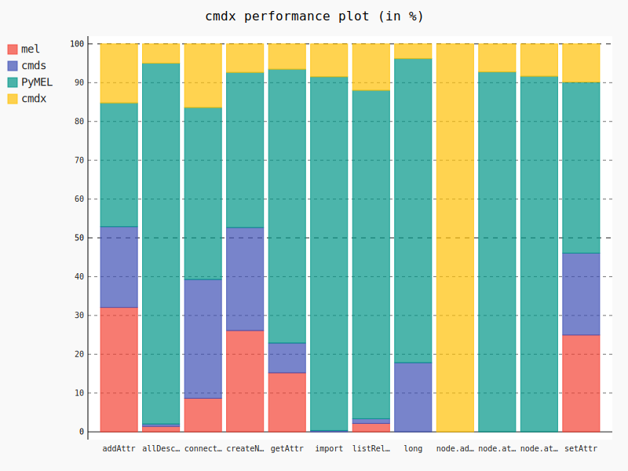
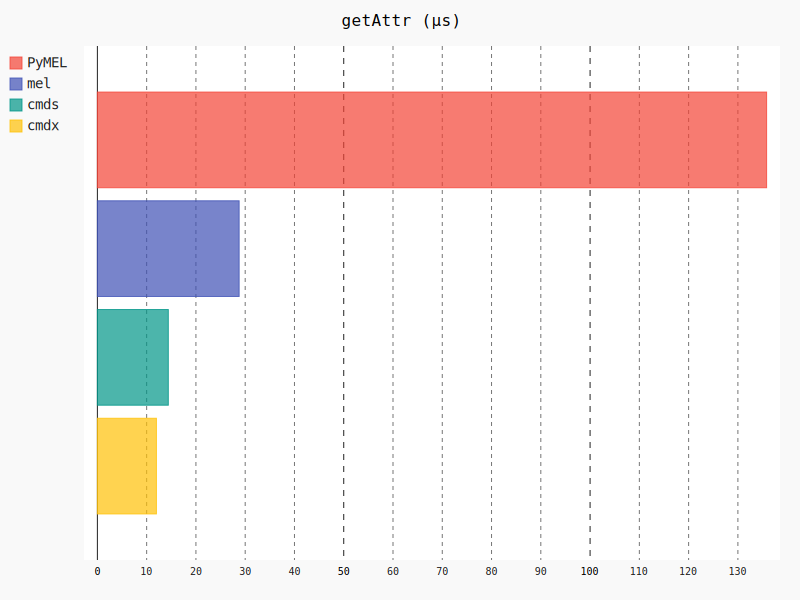
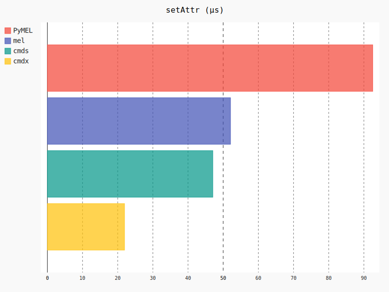
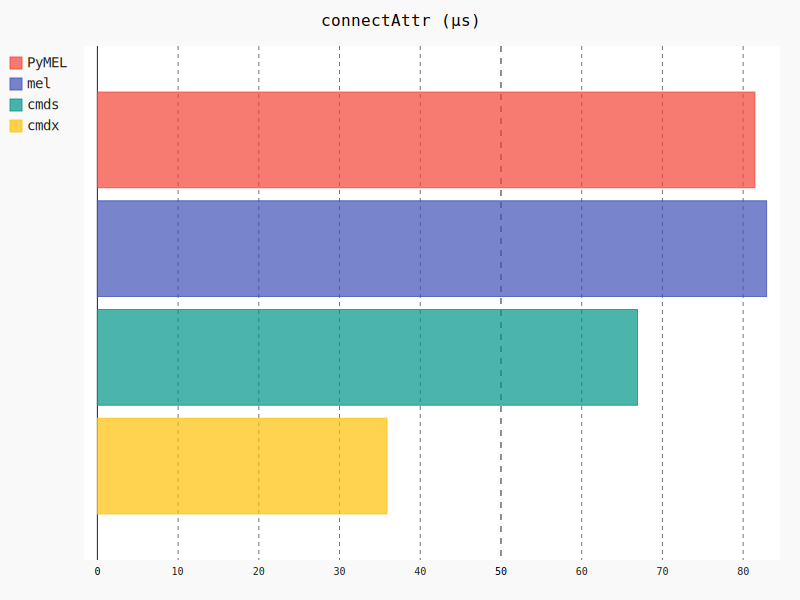

Fast subset of `maya.cmds`

<br>

### About

`cmdx` is a fast subset of the `maya.cmds` module, with persistent references to nodes.

```python
import cmdx

box = cmdx.createNode("transform", name="myBox")
cmdx.rename(box, "yourBox")
child = cmdx.createNode("transform", name="myChild", parent=box)
cmdx.setAttr(box + ".translateX", 5)
group = cmdx.group(empty=True)
cmdx.parent(box, group)
cmdx.delete(box)
```

The traditional `cmds` module is fast, but references nodes by strings. PyMEL offers references that stick through parenting and renaming, but lacks performance. `cmdx` is both fast and persistent; even faster than `cmds` by 2-5x.

**Commands**

- `createNode`
- `getAttr`
- `setAttr`
- `addAttr`
- `connectAttr`
- `listRelatives`
- `ls`

**Attribute Types**

- `Double`
- `Double3`
- `Enum`
- `String`
- `Message`
- `Boolean`
- `Divider`
- `Long`

<br>

### Transition

`cmdx` works as a drop-in replacement for `cmds`, meaning you can search-and-replace `cmds` with `cmdx` and expect everything to work alike; if not then that's a bug and you should file [an issue]().

Once you are confident in `cmdx`, you can start improving readability.

**Before**

```python
node = cmds.rename(node, "newName")
```

**After**

```python
cmds.rename(node, "newName")
```

- See [Optimising for Readability](#optimising-for-readability) for more tips and tricks.

<br>

### Interoperability

`cmdx` is designed to work alongside `cmds`, with one caveat; paths are **absolute**, not relative.

For example.

```python
group = cmdx.group(name="group", empty=True)
print(group)
# |group
```

Conversely, `cmds` returns the *shortest* path to any node, which in some cases is the above, in other cases only `group|child` and in others only `child`.

Under the hood, references to each node in `cmdx` is made via a unique identifiers known as a "uuid".

```python
node1 = cmds.createNode("transform", name="node1")
node2 = cmds.createNode("transform", name="node1", parent=node1)

cmds.rename(node1, "node2")
# ERROR: More than one object matches name

node1 = cmdx.createNode("transform", name="node1")
node2 = cmdx.createNode("transform", name="node1", parent=node1)

cmdx.rename(node1, "node2")
# OK
```

This works because the UUID of `node1` is independent of its name and place in the hierarchy.

<br>

### Optimising for Readability

Code is read more often than it is written.

**Before**

```python
node = cmds.createNode("transform", name="myNode")
node = cmds.parent(node, otherNode)
```

**After**

```python
node = cmds.createNode("transform", name="myNode")
cmds.parent(node, otherNode)
```

Readability can be improved further with a little object-oriented syntax sugar.

```python

```

<br>

### Identity

Perhaps the greatest strength of `cmdx` over `cmds` is the relationship between your variable and node.

With `cmds`, nodes are referenced via their relative path at the time of creation.

```python
mynode = cmds.createNode("transform", name="myNode")
cmds.parent(cmds.group(empty=True))
cmds.rename(mynode, "yourNode")
# Error
```

Because the node referenced by the variable `mynode` was re-parented, the link between it and the node is severed. To account for this, the `cmds.parent` command returns an updated reference to the node.

```python
mynode = cmds.createNode("transform", name="myNode")
mynode = cmds.parent(cmds.group(empty=True))
cmds.rename(mynode, "yourNode")
# Success
```

But this does not account for children.

```python
parent = cmds.createNode("transform")
child = cmds.createNode("transform", parent=parent)

parent = cmds.rename(parent, "myParent")
child = cmds.rename(child, "myNode")
# Error
```

Despite our best efforts, the link between `child` and the node is again severed.

### Attribute Query and Assignment

The traditional interface works as you would expect.

```python
transform, generator = cmdx.sphere()
cmdx.setAttr(generator + ".radius", 2)
```

The equivalent extended interface looks like this.

```python
transform, generator = cmdx.sphere()
generator["radius"] = 2
```

Reading an attribute works similarly.

```python
print(cmdx.getAttr(generator + ".subdivisionHeight"))
# 20
print(generator["subdivisionAxis"])
# 20
```

### Connections

Connecting one attribute to another, unsurprisingly, works the way you would expect.

```python
a, b = cmdx.createNode("transform"), cmds.createNode("transform")
cmdx.connectAttr(a + ".translateX", b + ".translateX")
```

With optional object-oriented conveniences.

```python
# Option 1
a["translateX"] >> b["translateX"]

# Option 2
a["translateX"].connect(b["translateX"])
```

```python
group["visibility"] = True
sphere
```

<br>

### Comparison

`cmds` and `pymel` is the equivalent of a rock and a hard place.

Maya's Embedded Language (MEL) makes for a compact scene description format.

```python
createNode transform -n "myNode"
	setAttr .tx 12
	setAttr .ty 9
```

On creation, a node is "selected" which is leveraged by subsequent commands, commands that also reference attributes via their "short" name to further reduce file sizes.

A scene description never faces naming or parenting problems the way programmers do. In a scene description, there is no need to rename nor reparent; a node is created either as a child of another, or not. It is given a name, which is unique. No ambiguity.

From there, it was given expressions, functions, branching logic and was made into a scripting language where the standard library is a scene description kit. 

`cmds` is tedious and `pymel` is slow. `cmds` is also a victim of its own success. Like MEL, it works with relative paths and the current selection; this facilitates the compact file format, whereby a node is created, and then any references to this node is implicit in each subsequent line. Long attribute names have a short equivalent and paths need only be given at enough specificity to not be ambiguous given everything else that was previously created. Great for scene a file format, not so great for code that operates on-top of this scene file.

With PyMEL as baseline, these are the primary goals of this project, in order of importance.

- Fast
  - Faster than PyMEL, faster than `maya.cmds`
- Persistent node references
  - Parent and rename nodes whilst keeping variables
- Argument signatures
  - Works with auto-complete and linting
- [X] Issue tracker
  - PyMEL has one, but because it is bundled alongside Maya any fixes or changes you or anyone else makes won't be seeing the light of day until the next Autodesk release cycle, and you wouldn't want your software dependent on the very latest release of Maya anyway. This discourages contribution and hinders innovation.
- [X] Small
  - You can read and understand this; magic and side-effects are discouraged.
- [X] Vendored
  - A single, self-contained, vendorable Python module of <1000 lines of code means you can fix bugs and add features specific to your project, without having to wait for the next version of Maya for others to benefit from it. (PyMEL cloc's in at 35,000 lines)
- [X] compatibility with maya.cmds
  - PyMEL is an all-or-nothing deal. You either use it everywhere, or not at all. This makes using it for its strengths difficult to impossible, without also suffering from its weaknesses.
  - For adoption, familiarity and ability to swap for `cmds` at any point in time via search-and-replace.
- [X] Faster
  - cmdx is 2-150x faster on average (see below)
- [X] PEP08
  - PyMEL is written in a multitude of styles with little to no linting
- [X] No side effects
  - PyMEL changes external function, classes and modules on import; presumably to account for flaws in its own design and the design of the externals. This is both dangerous, unexpected and 
- [X] Customisable
  - PyMEL is bundled with Maya, making it difficult to impossible to expect users to install and maintain their own copy.
  - PyMEL is large and riddled with hacks to account for bugs encountered throughout the years.
  - PyMEL is multi-module, multi-package 
- [X] Single module

```bash
root@0e540f42ee9d:/# git clone https://github.com/LumaPictures/pymel.git
Cloning into 'pymel'...
remote: Counting objects: 21058, done.
remote: Total 21058 (delta 0), reused 0 (delta 0), pack-reused 21058
Receiving objects: 100% (21058/21058), 193.16 MiB | 15.62 MiB/s, done.
Resolving deltas: 100% (15370/15370), done.
Checking connectivity... done.
root@0e540f42ee9d:/# cd pymel/
root@0e540f42ee9d:/pymel# ls
CHANGELOG.rst  LICENSE  README.md  docs  examples  extras  maintenance  maya  pymel  setup.py  tests
root@0e540f42ee9d:/pymel# cloc pymel/
      77 text files.
      77 unique files.
       8 files ignored.

http://cloc.sourceforge.net v 1.60  T=0.97 s (71.0 files/s, 65293.4 lines/s)
-------------------------------------------------------------------------------
Language                     files          blank        comment           code
-------------------------------------------------------------------------------
Python                          67           9769          22410          31251
DOS Batch                        2              0              0              2
-------------------------------------------------------------------------------
SUM:                            69           9769          22410          31253
-------------------------------------------------------------------------------
```
<br>

### Performance

Below is a performance comparisons between the available methods of manipulating the Maya scene graph.

- `MEL`
- `cmds`
- `cmdx`
- `PyMEL`
- `API 1.0`
- `API 2.0`

Surprisingly, `MEL` is typically outdone by `cmds`. Unsurprisingly, `PyMEL` performs on average 10x slower than `cmds`, whereas `cmdx` performs on average 5x faster than `cmds`.

<br>

#### MDagModifier

`createNode` of `OpenMaya.MDagModifier` is ~20% faster than `cmdx.createNode` *excluding* load. Including load is 5% *slower* than `cmdx`. 

```python
from maya.api import OpenMaya as om

mod = om.MDagModifier()

def prepare():
    New()
    for i in range(10):
        mobj = mod.createNode(cmdx.Transform)
        mod.renameNode(mobj, "node%d" % i)

def createManyExclusive():
    mod.doIt()


def createManyInclusive():
    mod = om.MDagModifier()

    for i in range(10):
        mobj = mod.createNode(cmdx.Transform)
        mod.renameNode(mobj, "node%d" % i)

    mod.doIt()

def createMany(number=10):
    for i in range(number):
        cmdx.createNode(cmdx.Transform, name="node%d" % i)

Test("API 2.0", "createNodeBulkInclusive", createManyInclusive, number=1, repeat=100, setup=New)
Test("API 2.0", "createNodeBulkExclusive", createManyExclusive, number=1, repeat=100, setup=prepare)
Test("cmdx", "createNodeBulk", createMany, number=1, repeat=100, setup=New)

# createNodeBulkInclusive API 2.0: 145.2 ms (627.39 µs/call)
# createNodeBulkExclusive API 2.0: 132.8 ms (509.58 µs/call)
# createNodeBulk cmdx: 150.5 ms (620.12 µs/call)
```

<br>

#### Overall Performance

Shorter is better.



#### import

Both `cmdx` and PyMEL perform some amount of preprocessing on import.


#### createNode


#### getAttr



#### setAttr



#### connectAttr



#### long

Retrieving the long name of any node, e.g. `cmds.ls("node", long=True)`.


#### node.attr

Both `cmdx` and PyMEL offer an object-oriented interface for reading and writing attributes.

```python
# cmdx
node["tx"].read()
node["tx"].write(5)

# PyMEL
pynode.tx().get()
pynode.tx().set(5)
```


#### ls

Both `cmdx` and PyMEL wrap results in an object-oriented interface to resulting nodes.

This one is great, as it tests the `__init__` of the internal class used to encapsulate a Maya node.


#### Mission

Because references to nodes are exact, the potential for performance is greater than that of `cmds`.